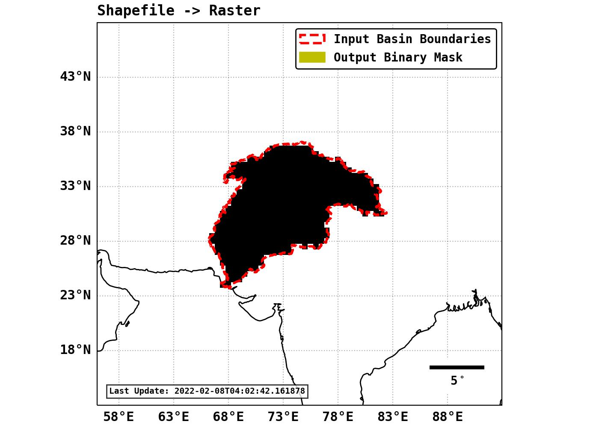
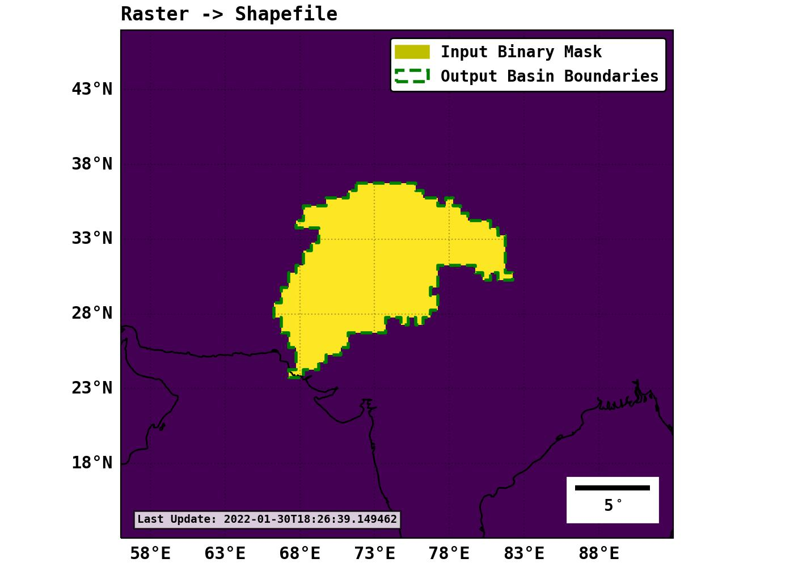

=======================================
Create Basin Binary Mask
=======================================
|Language|
|License|

.. |Language| image:: https://img.shields.io/badge/python-v3.8-green.svg
   :target: https://www.python.org/

.. |License| image:: https://img.shields.io/badge/license-MIT-green.svg
   :target: https://github.com/eciraci/Download_ECMWF_Data/blob/main/LICENSE

This repository contains small collection of scripts that can be used to:

1. Compute the binary mask of a basin from its boundaries provided as a esri shapefile.
2. Extract the boundaries o basin from its raster binary mask.

\
\

**Examples**:

1. Conversion from shapefile boundaries to raster binary mask::

     python convert_shp_to_raster.py './data/input/Indus.dir/Indus.shp'  --res=0.5

\
\

2. Conversion from raster binary mask to  shapefile boundaries:

     python convert_raster_to_shp.py './data/output/shapefile_to_raster/Indus.tiff'

\
\
**PYTHON DEPENDENCIES**:
#######
 - `numpy: The fundamental package for scientific computing with Python <https://numpy.org>`_
 - `xarray: xarray: N-D labeled arrays and datasets in Python <https://xarray.pydata.org/en/stable>`_
 - `pandas: Python Data Analysis Library <https://pandas.pydata.org>`_
 - `geopandas: Python tools for geographic data <https://geopandas.org/en/stable/>`_
 - `rasterio: access to geospatial raster data <https://rasterio.readthedocs.io>`_
 - `fiona: reads and writes geographic data files <https://fiona.readthedocs.io>`_
 - `shapely: Manipulation and analysis of geometric objects in the Cartesian plane. <https://shapely.readthedocs.io/en/stable>`_
 - `cartopy: Python package designed to produce maps and other geospatial data analyses. <https://scitools.org.uk/cartopy>`_
 - `matplotlib: Library for creating static, animated, and interactive visualizations in Python. <https://matplotlib.org>`_

\
\
License
#######

The content of this project is licensed under the
`Creative Commons Attribution 4.0 Attribution license <https://creativecommons.org/licenses/by/4.0/>`_
and the source code is licensed under the `MIT license <LICENSE>`_.